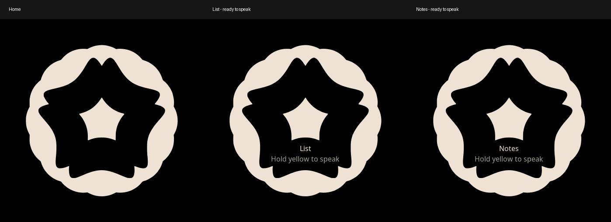

# ORBIT-ADD-01 — Keep List/Notes capture on the face

Current: implemented, rendered and built; visual preview accepted; installed on Ring 2; normal boot and preferred Wi-Fi verified; physical add-screen acceptance pending. Codex owner. Dennis requested this on
30 September 2026 as part of the existing Orbit menu workstream. Related:
MENU-KV-01/02 and WIFI-05. Based on menu candidate 4f96977 (including Wi-Fi
3519f4b); Ring 2 was updated from corrected 96888cc to 235d9c4 after fresh recovery verification.

Outcome: empty List and Notes retain the exact Home crest and quiet destination
label. Press yellow and speak, release to send, using the existing recording path.
The short pocket-lock chord window remains; no long-press gate is introduced.
Menu yellow five-second Wi-Fi entry, filled lists, timers and lock stay unchanged.
Dennis approved the rendered preview and its existing press/hold/release interaction.
No audio-pipeline change is included.

Acceptance: render actual production assets/fonts and compare Home geometry;
verify empty/list/empty and capture transitions; run button/chord/Wi-Fi checks;
build the StopWatch firmware with verified QR configuration and dependency lock;
inspect flash headroom. Independent review and hardware acceptance remain separate.
Dennis authorized installation on 30 September. No merge or Ring 1 rollout; keep
existing physical tests pending.

For Dennis: on Ring 2, press blue for the menu, swipe to List or Notes and tap
yellow to open it. An empty screen should retain the Home crest and show the
small destination/speaking cue; existing items remain visible on a populated
screen (do not delete them for this test). Hold yellow and speak, then release.
Return whether the face looks right and capture starts/stops correctly. No phone
app or further reset is needed. Blocks physical add-screen/capture acceptance.

Change log — 30 September 2026 — Codex — ORBIT-ADD-01: began replacement of the
blank hold-to-add screen with the existing face crest and a small capture cue.

## Engineering evidence — 30 September 2026

- Native LVGL uses the actual renderer, crest assets and production fonts. Pixels
  outside the two caption rows match Home exactly. List/Notes/re-entry restores
  full crest opacity; existing six-menu-page, timer/removal and switch checks pass.
- Eleven Wi-Fi tests, three crest tests, two button-chord tests and one theme
  test pass. The actual yellow callback test verifies recording starts after the
  existing 150 ms chord window outside the menu, stops on release, and retains
  the separate five-second Wi-Fi gesture and pocket lock.
- ESP-IDF 6.0.2 StopWatch build passes with CONFIG_LV_USE_QRCODE=y, the verified
  Wi-Fi sdkconfig and unchanged dependency lock (dl_fft 0.7.0). QR create/update
  symbols are linked. Unsigned image 3,997,696 bytes; projected signed size
  4,001,792, leaving 126,976 bytes in ota_0. No signing or flashing performed.
- Self-checked by Codex. Independent review and physical microphone/display
  acceptance are pending. Focused checks do not resolve the four previously
  recorded broad-suite failures on the base candidate.

Change log — 30 September 2026 — ORBIT-ADD-01 — Codex: replaced the empty prompt
with the unchanged Home crest, a List/Notes label and quiet yellow-button cue.
Removed the separate animated arrow on this empty screen; filled lists restore
normal text layout. Existing press-to-record/release-to-send behavior remains.
Rendered actual pixels, passed 17 focused checks and built the QR-enabled target.
Source branch: codex/orbit-add-face, based on 4f96977. Not installed or merged.

Change log — 30 September 2026 — ORBIT-ADD-01 — Codex: Dennis approved the preview
and explicitly requested installation. Rebuilt clean 235d9c4, signed and verified
the 4,001,792-byte image. Ring 2 identity/security passed; fresh full-device recovery
and guarded app-only installation are in progress. No success or physical acceptance
is claimed by this entry.

Change log — 30 September 2026 — ORBIT-ADD-01 — Codex: installed approved firmware
235d9c4 on Ring 2. Exact identity/security, partition, active app slot, prior app,
fresh 16 MB backup and persisted preferred-profile checks passed before writing.
App-only write at 0x20000; app and full-device verification passed afterward,
confirming every other flash byte unchanged. Signed image 4,001,792 bytes.
The candidate also includes the existing 4f96977 empty-timer pulse fix. Ring 1
unchanged; no branch merged. Protected installation/recovery records are saved.
Ring 2 remains in DOWNLOAD mode pending one brief physical reset. Normal boot,
preferred-network connection and physical add-screen/capture checks remain open
for this revision. Independent review remains separate from preview approval.

Change log — 30 September 2026, 15:24 UTC — ORBIT-ADD-01 / WIFI-05 — Codex:
Dennis confirmed the face returned. A 40-second USB observation verified normal
flash boot, crest theme, preferred saved-network connection, activation and idle.
Protected profile verification identifies the preferred network as Koji. The
observation also saw idle → listening → idle, which does not by itself prove
saved dictation or its contents. No panic, watchdog, stack overflow or assertion
was observed. USB opening may restart the ring; no raw logs retained. Evidence:
protected package `boot-observation-after-physical-reset.json`. No firmware
changes. Earlier DOWNLOAD/reset-pending snapshots are superseded. Visual/capture
acceptance and previously pending Wi-Fi/menu/voice checks remain open.
