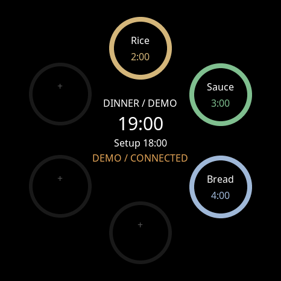
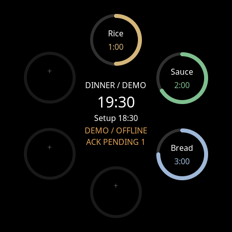
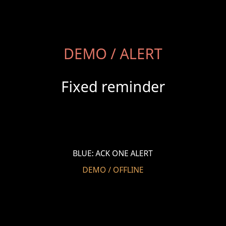

# Orbit working timer demo — 8 September 2026

**Design decision: Dennis rejected this engineering fixture's face.** Keep its
decoder/scheduler/alarm tests; do not install or promote its appearance. The evolved
iPhone `FreestyleTimerBoardView` is the accepted reference. Next is a side-by-side
parity comparison, preserving the existing design and naming hardware constraints.

The actual LVGL face now runs locally with three cooking timers, a dinner service
and linked setup cue. The strict decoder consumes the unchanged shared JSON
fixture; `FaceModel` connects the scheduler to the existing `SlotBoard` and
`AlarmState`. This is a running implementation with a synthetic clock and mock
receipts, not physical acceptance or a live KitchenMEP integration.

## Try it locally

From the firmware checkout:

```sh
ORBIT_CMAKE=/tmp/orbit-schedule-cmake/cmake/data/bin/cmake python3 main/boards/m5stack/stopwatch/tests/run_service_schedule_demo.py --port 8768
```

The current host has the required compiler, CMake and managed components. The
runner also accepts standard CMake on PATH. Open `http://127.0.0.1:8768`:

1. Rice, Sauce and Bread count down. Dinner is 19:00 and setup is 18:00.
2. Next checkpoint moves dinner to 19:30 and setup to 18:30. Cooking timers and
   the independent fixed 18:00 reminder keep their identities and deadlines.
3. Advance through simulated disconnect and the fixed reminder's due time.
   Acknowledge it. The face shows OFFLINE and ACK PENDING.
4. Advance through the three cooking deadlines, acknowledging each. Acknowledge
   only one when several are due to verify the other alarms remain active.
5. Reconnect leaves acknowledgements pending. The next checkpoint supplies one
   exact **mock** receipt; remaining ACKs stay pending. Old snapshots cannot reset
   the accepted schedule. Setup becomes due at 18:30.
6. A deliberate clock rollback shows CHECK TIME. Cached data cannot fabricate a
   trusted countdown. Restart is a local fixture reset only.





## Evidence

- 25 portable scheduler and 26 strict decoder tests pass with ASan/UBSan.
- Eight integrated tests pass using actual LVGL, the board's Noto 16/30 fonts,
  decoder, scheduler and alarm transition engine; 17 framebuffer captures are
  generated by the runner's `--capture` option.
- HTTP smoke verifies real countdown progression, alert, acknowledgement and reset.
- Existing timer snapshot/parser/dial tests: 3 pass. Timer/output regressions: 52
  pass. Build/asset runner tests: 68 pass.
- ESP-IDF 6.0.2 full builds pass for the synthetic bench, normal Provisions
  StopWatch and generic StopWatch (representative MQTT path). The unsigned bench application is
  2,928,192 bytes, SHA-256
  `eac57ed8a35ba39373f770d218021e1a6a4e926f291e9357b1268cb80c30f804`.
  Current-host artifact directory:
  `/Users/dojo/.codex/device-builds/orbit-service-schedule/2026-09-08`.

The full build also exposed two baseline integration defects. Merge `be489cbc0`
retained the old Application header while accepting newer implementation code.
The repair restores second-parent `1d43eca` declarations and preserves the merge's
timer-snapshot additions. The unfinished output-fence runtime was registered
unconditionally despite its WebSocket APIs being guarded; CMake now uses that same
guard. Neither change enables the unfinished fence.

## Board and remaining physical step

Read-only USB metadata identifies the connected Espressif 303A:1001 unit at
`/dev/cu.usbmodem1101`, serial `28:84:85:44:6B:10`, matching the September 7
acceptance record. No port open, reset, flash, credential creation or live request
was performed. The documented installed capture build `a4376a3` predates this
schedule path; USB metadata alone does not attest a current firmware hash.

The unsigned local bench candidate has its own identity. It disables networking,
uses DummyAudioCodec, and maps yellow to checkpoint/blue to exact local ACK.
The existing alarm motor callback is wired in source but untested physically.
It cannot prove sound, haptic strength, clock accuracy, restart durability,
radio-loss delivery, battery life or the 48-hour soak.

The next step is visual parity, not installing this rejected face. A later physical
candidate requires explicit authorization and the established app-only
backup/signature/compatibility procedure. **The existing no-flash boundary remains
in force.** The generated multi-region flash command is not an installation plan.
The local runner remains an engineering test artifact; no additional cable or
invented device ID is needed.

Live schedule admission, freshness/clock policy, durable state and authoritative
ACK reconciliation remain separate integration work. No live service-schedule
capability is advertised, and the existing timer/audio player keeps its authority.
